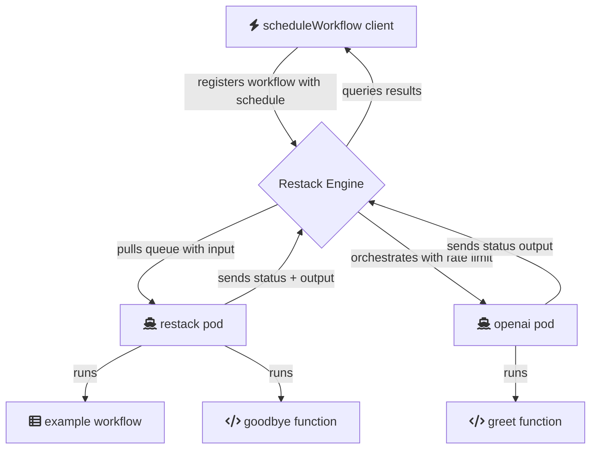

# Requirements

- Node 20 or higher

brew install nvm
nvm use 20

- pnpm

brew install pnpm

# Start pods

Where all your code is defined, including workflow steps.

add OPENAI_API_KEY in .env

pnpm i

pnpm dev

Your code will be running in pods and syncing with Restack engine to execute workflows or functions.

# Schedule a workflow

In another shell:

pnpm workflow

Will schedule to start example workflow immediately.

# Architecture

# Deploy

pnpm restack-up
