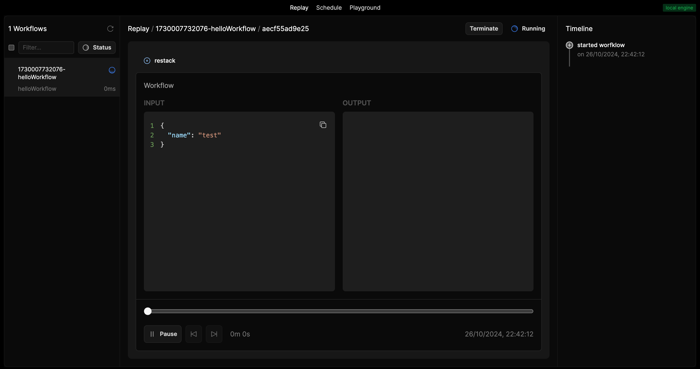

# Next.js with Together AI and LlamaIndex Integration

This project demonstrates how to build a Next.js application that integrates Together AI and LlamaIndex for AI-powered functionalities. The project consists of a frontend built with Next.js and a backend service handling AI operations.

## Project Structure

- `frontend/`: Next.js frontend application
- `backend/`: Node.js backend service with Together AI and LlamaIndex integration

## Prerequisites

- Node.js (LTS version)
- Docker
- Together AI API key
- Restack Engine setup

## Getting Started

### 1. Install Restack Web UI

First, install the Restack Web UI using Docker:

```bash
docker run -d --pull always --name studio -p 5233:5233 -p 6233:6233 -p 7233:7233 ghcr.io/restackio/restack:main
```

### 2. Set Up Backend

1. Navigate to the backend directory:

```bash
cd backend
```

2. Install dependencies:

```bash
npm install
```

3. Create a `.env` file with your credentials:

```
TOGETHER_API_KEY=your_together_api_key

# Optional:
RESTACK_ENGINE_ID=your_engine_id
RESTACK_ENGINE_ADDRESS=your_engine_address
RESTACK_ENGINE_API_KEY=your_engine_api_key
```

4. Start the backend service:

```bash
npm run dev
```

### 3. Set Up Frontend

1. Navigate to the frontend directory:

```bash
cd frontend
```

2. Install dependencies:

```bash
npm install
```

3. (Optional) Create a `.env` file:

```
# Optional:
RESTACK_ENGINE_ID=your_engine_id
RESTACK_ENGINE_ADDRESS=your_engine_address
RESTACK_ENGINE_API_KEY=your_engine_api_key
```

4. Start the development server:

```bash
npm run dev
```

Visit [http://localhost:3000](http://localhost:3000) to see the application.

## Available Features

1. **Chat Completion Example**: Demonstrates basic chat completion using Together AI's Llama models
2. **LlamaIndex Integration**: Shows how to query models using LlamaIndex with Together AI integration

## Docker Deployment

You can deploy both frontend and backend using Docker Compose:

```bash
docker-compose up -d
```

This will:

- Build and start the frontend on port 3000
- Build and start the backend on port 8000
- Set up proper networking between services

## Deploy on Restack

To deploy this application on Restack:

1. Ensure you have Restack Cloud credentials
2. Set up required environment variables
3. Run the deployment script:

```bash
node restack_up.mjs
```

For detailed deployment information, see the [Restack Cloud documentation](https://docs.restack.io/restack-cloud/deployrepo).

## Project Components

### Frontend

- Next.js 14 application
- Server Actions for workflow triggering
- Tailwind CSS for styling
- Type-safe API integration

### Backend

- Node.js backend service
- Together AI integration for LLM operations
- LlamaIndex for enhanced AI capabilities
- Rate-limited API calls (60 RPM)

## Example Workflows

The application includes two main workflows:

1. **Chat Completion Basic**: Generates greeting and farewell messages using Together AI models
2. **LlamaIndex Together Simple**: Demonstrates LlamaIndex integration with Together AI for complex queries

## Screenshots


_Main application interface_


_Restack Web UI showing workflow execution_

## Contributing

Feel free to submit issues and enhancement requests.
