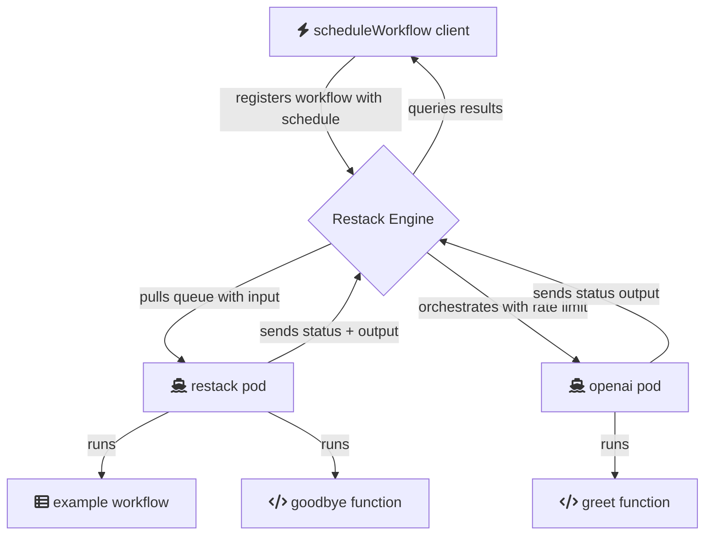

# Requirements

- Node 20 or higher

brew install nvm
nvm use 20

- pnpm

brew install pnpm

# Install Restack Web UI 

To install the Restack Web UI, you can use Docker.
```
docker run -d --pull always --name studio -p 5233:5233 -p 6233:6233 -p 7233:7233 ghcr.io/restackio/restack:main
```

# Start services

Where all your code is defined, including workflow steps.

add OPENAI_API_KEY in .env

```bash
pnpm i

pnpm dev
```
Your code will be running and syncing with Restack engine to execute workflows or functions.

# Schedule a workflow

In another shell:

pnpm schedule

Will schedule to start example workflow immediately.

# Architecture



## Deploy on Restack

pnpm restack-up

To deploy the application on Restack, you can use the provided `restack_up.mjs` script. This script utilizes the Restack Cloud SDK to define and deploy your application stack. It sets up the necessary environment variables and configures the application for deployment. 

To get started, ensure you have the required Restack Cloud credentials and environment variables set up. Then, run the script to initiate the deployment process. 

For more detailed information on deploying your repository to Restack, refer to the [Restack Cloud deployment documentation](https://docs.restack.io/restack-cloud/deployrepo).